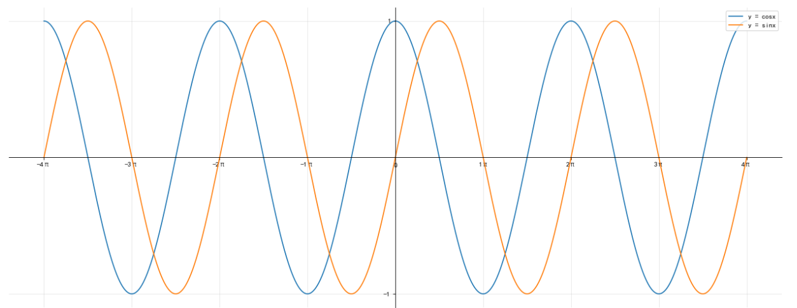
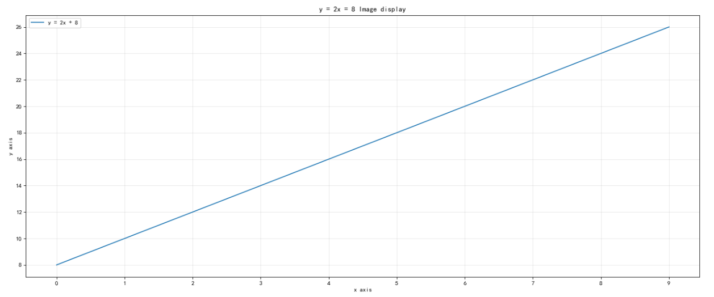
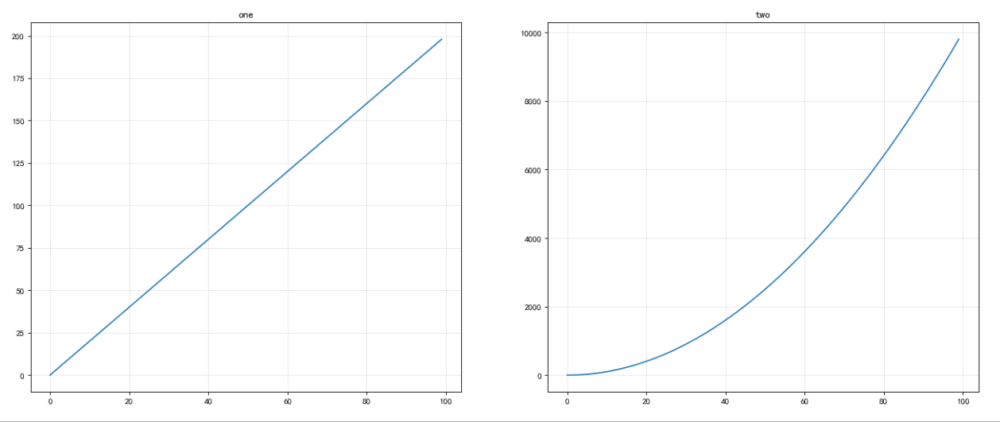
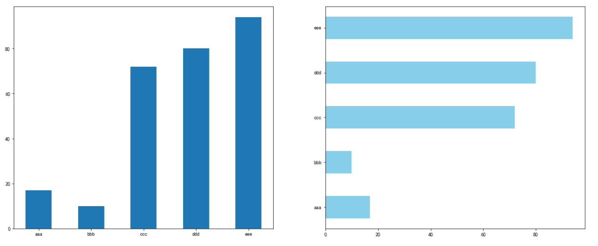
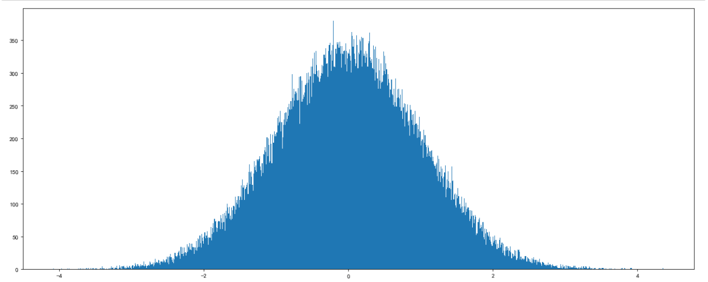
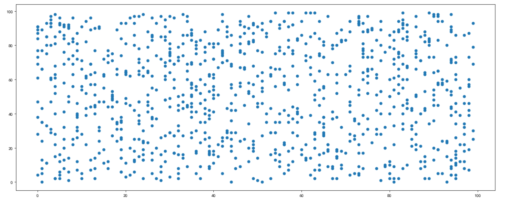

Matplotlib 尝试使容易的事情变得更容易，使困难的事情变得可能。 您只需几行代码就可以生成图表、直方图、功率谱、条形图、误差图、散点图等

<!-- more -->


## 各个图像的优缺点

---

| 图像   | 描述                                                  | 特点                                                         |
| ------ | ----------------------------------------------------- | ------------------------------------------------------------ |
| 折线图 | 以折线的上升或下降来表示统计数量的增减变化的统计图    | 能够显示数据的变化趋势，反映事物的变化情况。(变化            |
| 直方图 | 由一系列高度不等的纵向条纹或线段表示数据分布的情况    | 绘制连**续性**的数据,展示一组或者多组数据的分布状况(统计)    |
| 条形图 | 排列在工作表的列或行中的数据可以绘制到条形图中        | 绘制连**离散**的数据,能够一眼看出各个数据的大小,比较数据之间的差别。(统计) |
| 散点图 | 用两组数据构成多个坐标点，考察坐标点的分布,判断两变量 | 判断变量之间是否存在数量关联趋势,展示离群点(分布规律)        |


## demo

---

---

```python
import matplotlib.pyplot as plt
import numpy as np


x = np.linspace(-4 * np.pi, 4 * np.pi, num=1000)
y1 = np.cos(x)
y2 = np.sin(x)
plt.figure(figsize=(20, 8), dpi=80)
# 坐标轴位置
ax=plt.gca()
ax.spines['bottom'].set_position(('data',0)) 
ax.spines['left'].set_position(('axes',0.5)) 
ax.spines['top'].set_color('none')
ax.spines['right'].set_color('none')

plt.plot(x, y1, label="y = cosx")
plt.plot(x, y2, label="y = sinx")
plt.legend(loc='upper right')
xticks = np.arange(-4 * np.pi, 5 * np.pi, np.pi)
xlabels = [r'%d$\pi$'%i for i in range(-4, 5)]
xlabels[4] = 0
plt.xticks(xticks, xlabels)
plt.yticks([-1, 1])
plt.grid(alpha=0.3)
# plt.savefig('cas.png')
plt.show()
```



# 折线图 plot

```python
import matplotlib.pyplot as plt
import numpy as np

x = np.arange(0, 10)
y = 2 * x + 8

plt.figure(figsize=(20, 8), dpi=80)
plt.plot(x, y, label='y = 2x + 8')
plt.xticks(x)
plt.yticks(y)
plt.title('y = 2x = 8 Image display')
plt.xlabel('x axis')
plt.ylabel('y axis')
plt.legend()
plt.show()
```



>  注意 : Matplotib中，最常用的模块是Pyplot，它提供了一套类似MATLAB的接口和命令。通常，绘图时都需要导入该模块

## 子图subplot

---

```python
import matplotlib.pyplot as pt
import numpy as np

x = np.arange(100)
y1 = 2 * x
y2 = x ** 2

plt.figure(figsize=(20, 8), dpi=80)
# 一行两列中第一个图
plt.subplot(1, 2, 1)
plt.plot(x, y1)
plt.grid(alpha=0.3)
# 一行两列中第二个图
plt.subplot(1, 2, 2)
plt.plot(x, y2)
plt.grid(alpha=0.3)
plt.show()
```



## 柱状图bar[h]

---

```python
import matplotlib.pyplot as pt
import numpy as np

y = np.random.randint(1, 100, 5)
x = ['aaa', 'bbb', 'ccc', 'ddd', 'eee']

plt.figure(figsize=(20, 8))
plt.subplot(1, 2, 1)
plt.bar(x, y, width=0.5)
plt.subplot(1, 2, 2)
plt.barh(x, y, color='skyblue', height=0.5)
plt.show()
```



## 饼图pie

---

```python
import numpy as np
import matplotlib.pyplot as plt
x = ["A", "B", "C", "D", "E"]
y = [20, 25, 15, 10, 20]
# 设置第二项为爆炸(散开)状态
Explode = [0, 0.1, 0, 0, 0]
# 绘制图形
plt.figure(figsize=(20, 8), dpi=80)
plt.pie(y, explode=Explode, labels=x, shadow=True, startangle=45)
plt.axis('equal')
plt.legend(title="List of x")
# 显示
plt.show()
```


## 直方图hist

---

```python
import numpy as np
import matplotlib.pyplot as plt
# 随机正态分布 X-N(0, 1)
y = np.random.randn(100000)
plt.figure(figsize=(20, 8), dpi=80)
# 数据  +  个数
plt.hist(y, 1000)
plt.show()
```



## 散点图scatter

---

```python
import numpy as np
import matplotlib.pyplot as plt
x = np.random.randint(0, 100, 1000)
y = np.random.randint(0, 100, 1000)

plt.figure(figsize=(20, 8), dpi=80)
plt.scatter(x, y)
plt.show()
```



## 参考文献

---

https://www.qikegu.com/docs/3620

https://www.matplotlib.org.cn/

[常见图表的应用场景](https://blog.csdn.net/a909301740/article/details/89791491)

[图解pyplot figure、subplot、axes、axis的区别](https://zhuanlan.zhihu.com/p/54131038)

[matplotlib后端解析](http://vra.github.io/2017/06/13/mpl-backend/)

[可视化工具中的github,相比于matplotlib更加简单,兼容matplotlib和pandas](https://plotly.com/python/)