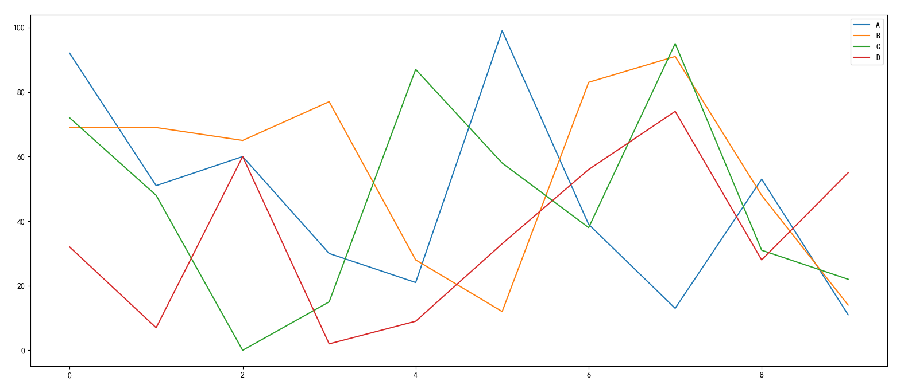

**Pandas** 是 [Python](https://www.python.org/) 的核心数据分析支持库，提供了快速、灵活、明确的数据结构，旨在简单、直观地处理关系型、标记型数据。

Pandas 适用于处理以下类型的数据：

- 与 SQL 或 Excel 表类似的，含异构列的表格数据;
- 有序和无序（非固定频率）的时间序列数据;
- 带行列标签的矩阵数据，包括同构或异构型数据;
- 任意其它形式的观测、统计数据集, 数据转入 Pandas 数据结构时不必事先标记。

<!-- more -->


### Series

> pandas.Series(data=None, index=None, dtype=None, name=None, copy=False, fastpath=False) 

```python
# 可遍历参数
s = pd.Series([1, 3, 5, np.nan, 6, 8], index=list('ABCDEF'))
'''
A    1.0
B    3.0
C    5.0
D    NaN
E    6.0
F    8.0
dtype: float64
'''
# 字典
d = {'A': 'a', 'B': 'b', 'C': 'c', 'D': 'd'}      
s1 = pd.Series(d)
s1
'''
A    a
B    b
C    c
D    d
dtype: object
'''
```

### date_range

> pd.date_range(start=None, end=None, periods=None, freq='D')

频率的缩写


```python
# 一般使用date_range充当DataFrame的索引
pd.date_range('20170703', '20170722')   
'''
DatetimeIndex(['2017-07-03', '2017-07-04', '2017-07-05', '2017-07-06',
               '2017-07-07', '2017-07-08', '2017-07-09', '2017-07-10',
               '2017-07-11', '2017-07-12', '2017-07-13', '2017-07-14',
               '2017-07-15', '2017-07-16', '2017-07-17', '2017-07-18',
               '2017-07-19', '2017-07-20', '2017-07-21', '2017-07-22'],
              dtype='datetime64[ns]', freq='D')
'''
pd.date_range('20170703', periods=20)
'''
DatetimeIndex(['2017-07-03', '2017-07-04', '2017-07-05', '2017-07-06',
               '2017-07-07', '2017-07-08', '2017-07-09', '2017-07-10',
               '2017-07-11', '2017-07-12', '2017-07-13', '2017-07-14',
               '2017-07-15', '2017-07-16', '2017-07-17', '2017-07-18',
               '2017-07-19', '2017-07-20', '2017-07-21', '2017-07-22'],
              dtype='datetime64[ns]', freq='D')
'''
pd.date_range('20170703', periods=20, freq='S')
'''
DatetimeIndex(['2017-07-03 00:00:00', '2017-07-03 00:00:01',
               '2017-07-03 00:00:02', '2017-07-03 00:00:03',
               '2017-07-03 00:00:04', '2017-07-03 00:00:05',
               '2017-07-03 00:00:06', '2017-07-03 00:00:07',
               '2017-07-03 00:00:08', '2017-07-03 00:00:09',
               '2017-07-03 00:00:10', '2017-07-03 00:00:11',
               '2017-07-03 00:00:12', '2017-07-03 00:00:13',
               '2017-07-03 00:00:14', '2017-07-03 00:00:15',
               '2017-07-03 00:00:16', '2017-07-03 00:00:17',
               '2017-07-03 00:00:18', '2017-07-03 00:00:19'],
              dtype='datetime64[ns]', freq='S')
'''

```

### DataFrame

```python
df = pd.DataFrame({'A': 1.,
     'B': pd.Timestamp('20130102'),
     'C': pd.Series(1, index=list(range(4)), dtype='float32'),
     'D': np.array([3] * 4, dtype='int32'),
     'E': pd.Categorical(["test", "train", "test", "train"]),
     'F': 'foo'
     })
df
'''
     A          B    C  D      E    F
0  1.0 2013-01-02  1.0  3   test  foo
1  1.0 2013-01-02  1.0  3  train  foo
2  1.0 2013-01-02  1.0  3   test  foo
3  1.0 2013-01-02  1.0  3  train  foo
'''     
```

### 常用方法

```python
import pandas as pd
import numpy as np

df = pd.DataFrame(np.random.randint(1, 100, 100).reshape(10, 10))
import pandas as pd
import numpy as np

df = pd.DataFrame(np.random.randint(1, 100, (6, 4)), columns=list('ABCD'))
# 
print(df.describe())
'''
               A          B         C          D
count   6.000000   6.000000   6.00000   6.000000
mean   42.666667  40.000000  39.00000  56.833333
std    42.183725  21.642551  33.39461  26.723897
min     1.000000  16.000000  10.00000  27.000000
25%     7.000000  23.250000  16.25000  36.250000
50%    34.500000  36.000000  27.50000  55.500000
75%    81.500000  59.250000  50.75000  71.000000
max    91.000000  66.000000  98.00000  97.000000
'''
print(df.head(3))
'''
    A   B   C   D
0  89  42  10  27
1  59  30  14  97
2   6  65  23  72
'''
print(df.tail(3))
'''
    A   B   C   D
3  17  48   8  34
4  14  66  15  43
5  33  79  12  27
'''
print(df.info())

'''
<class 'pandas.core.frame.DataFrame'>
RangeIndex: 6 entries, 0 to 5
Data columns (total 4 columns):
 #   Column  Non-Null Count  Dtype
---  ------  --------------  -----
 0   A       6 non-null      int32
 1   B       6 non-null      int32
 2   C       6 non-null      int32
 3   D       6 non-null      int32
dtypes: int32(4)
memory usage: 224.0 bytes
None
'''
# 通过莫一列进行排序
df = df.sort_values(by='B')
# 通过应用有每一项
df.apply(lambda x: x ** 2)
```

### 获取数据

---

```python
import pandas as pd
import numpy as np

df = pd.DataFrame(np.random.randint(1, 100, (6, 4)), columns=list('ABCD'))
# 直接使用索引获取列
print(df['A'])
# 直接使用切片对行操作
print(df[::3])
'''
0    59
1    52
2    38
3     6
4    54
5    52
Name: A, dtype: int32
    A   B   C   D
1  52  43   4  28
2  38  68  45  28
'''
# 通过标签获取， 与numpy类似， 区别loc可以取到切片右边值
print(df.loc[:, 'A'])
print(df.loc[:, :'C'])
print(df.loc[:0, ::2])
print(df.loc[:0, ['A', 'C']])
'''
0    41
1    85
2    98
3    49
4    95
5    11

Name: A, dtype: int32
    A   B   C
0  41  77  23
1  85  79  84
2  98  72  26
3  49  66  11
4  95  23  30
5  11  47  64

    A   C
0  41  23

    A   C
0  65  12
'''

# 按照位置获取， 完全和numpy类似
print(df.iloc[:, 1])
print(df.iloc[[1, 2], [1, 2]])
'''
print(df.iloc[:, 1])
print(df.iloc[[1, 2], [1, 2]])
'''
# 与numpy一一对应不同
print(df.iloc[[1, 2, 4], [0, 2]])
'''
    A   C
1   2  99
2  63  17
4  61  84
'''
# 布尔索引
print(df[df['A'] > 50])
'''
    A   B   C   D
3  60   9  20  98
5  80  64  50  11
'''
```

### Nan操作

---

```python
# 删除nan
import pandas as pd
import numpy as np

df = pd.DataFrame(np.random.randint(1, 100, (6, 4)), columns=list('ABCD'))
df.loc[2:3, 'B':'C']
'''
    A     B     C   D
0  19  84.0  80.0  70
1  43   4.0  97.0  97
2  47   NaN   NaN  17
3   9   NaN   NaN  87
4  79  29.0  68.0  31
5  13  79.0  64.0  81
'''
# 删除nan行
# DataFrame.dropna(axis=0, how='any', thresh=None, subset=None, inplace=False) 
# all: 所有都缺失才删除， any： 缺失即删除
df.dropna(how='any') 
'''
    A     B     C   D
0  19  84.0  80.0  70
1  43   4.0  97.0  97
4  79  29.0  68.0  31
5  13  79.0  64.0  81
'''
# 填充nan
df.fillna(0)   
'''
    A     B     C   D
0  19  84.0  80.0  70
1  43   4.0  97.0  97
2  47   0.0   0.0  17
3   9   0.0   0.0  87
4  79  29.0  68.0  31
5  13  79.0  64.0  81
'''
pd.isna(df)
'''
       A      B      C      D
0  False  False  False  False
1  False  False  False  False
2  False   True   True  False
3  False   True   True  False
4  False  False  False  False
5  False  False  False  False
'''
```

### Series字符串方法

---

```python
import pandas as pd

data = ['1:a', '2:b', '3:c', '4:d']
s = pd.Series(data)
print(s.str[2:])
'''
0    a
1    b
2    c
3    d
'''
print(s.str.split(':'))
'''
0    [1, a]
1    [2, b]
2    [3, c]
3    [4, d]
dtype: object
'''
print(s.str.replace(':', ','))
'''
0    1,a
1    2,b
2    3,c
3    4,d
dtype: object
'''
print(s.str.contains('a'))
'''
0     True
1    False
2    False
3    False
dtype: bool

'''
```

### join

```python
import numpy as np
import pandas as pd
t1 = pd.DataFrame(np.arange(24).reshape((4, 6)), index=list('ABCD'), columns=list('abcdef'))
'''
    a   b   c   d   e   f
A   0   1   2   3   4   5
B   6   7   8   9  10  11
C  12  13  14  15  16  17
D  18  19  20  21  22  23
'''

# 1. 列索引不能有相同索引 
t2 = pd.DataFrame(np.arange(24).reshape((4, 6)), index=list('ABCD'), columns=list('ghklmn'))
'''
    g   h   k   l   m   m
A   0   1   2   3   4   5
B   6   7   8   9  10  11
C  12  13  14  15  16  17
D  18  19  20  21  22  23
'''

# 1. 相同行索引列合并
t1.join(t2)
'''
    a   b   c   d   e   f   h   j   k   l   m   n
A   0   1   2   3   4   5   0   1   2   3   4   5
B   6   7   8   9  10  11   6   7   8   9  10  11
C  12  13  14  15  16  17  12  13  14  15  16  17
D  18  19  20  21  22  23  18  19  20  21  22  23
'''

# 2. 不同行索引
t2 = t2.loc[:'B', :]
t2.index = list('EF')
'''
   h  j  k  l   m   n
E  0  1  2  3   4   5
F  6  7  8  9  10  11
'''

t1.join(t2)
'''
    a   b   c   d   e   f   h   j   k   l   m   n
A   0   1   2   3   4   5 NaN NaN NaN NaN NaN NaN
B   6   7   8   9  10  11 NaN NaN NaN NaN NaN NaN
C  12  13  14  15  16  17 NaN NaN NaN NaN NaN NaN
D  18  19  20  21  22  23 NaN NaN NaN NaN NaN NaN
'''

t2.join(t1)
'''
   h  j  k  l   m   n   a   b   c   d   e   f
E  0  1  2  3   4   5 NaN NaN NaN NaN NaN NaN
F  6  7  8  9  10  11 NaN NaN NaN NaN NaN NaN
'''
```

### merge

```python
import pandas as pd
import numpy as np

t1 = pd.DataFrame(np.zeros((3, 4), dtype='int'), columns=list('abcd'))
'''
   a  b  c  d
0  0  0  0  0
1  0  0  0  0
2  0  0  0  0
'''

t2 = pd.DataFrame(np.zeros((3, 4), dtype='int'), columns=list('abce'))
'''
   a  b  c  e
0  0  0  0  0
1  0  0  0  0
2  0  0  0  0
'''

# 1. 默认情况，相同列索引并集（内连接inner）
t1.merge(t2)
'''
   a  b  c  d  e
0  0  0  0  0  0
1  0  0  0  0  0
2  0  0  0  0  0
3  0  0  0  0  0
4  0  0  0  0  0
5  0  0  0  0  0
6  0  0  0  0  0
7  0  0  0  0  0
8  0  0  0  0  0
'''
# 2. 外连接， 左外连接， 右外连接
t1.merge(t2, on='a', how='right') # left | right | outer | inner
```

### 分组groupby

> https://blog.csdn.net/cindy407/article/details/91387555

```python
import pandas as pd

data = {
    'name': ['A', 'C', 'A', 'D', 'B'],
    'age': [20, 21, 15, 20, 10],
    'sex': ['m', 'n', 'm', 'n', 'n'],
}

df = pd.DataFrame(data)
group = df.groupby(by='name')
print(list(group))
print(group.count())
'''
('A',   name  age sex
0    A   20   m
2    A   15   m)
('B',   name  age sex
4    B   10   n)
('C',   name  age sex
1    C   21   n)
('D',   name  age sex
3    D   20   n)

# group.count()
      age  sex
name          
A       2    2
B       1    1
C       1    1
D       1    1
'''
s = pd.Series(['aaa', 'bbb', 'ccc', 'ddd'])
list(s.groupby([1, 2, 2, 1])) 
'''
[(1,
  0    aaa
  3    ddd
  dtype: object),
 (2,
  1    bbb
  2    ccc
  dtype: object)]
'''
  
```

### 复合索引

---

```python
import pandas as pd
import numpy as np

tuples = [*zip(['a', 'a', 'c', 'c', 'b'], np.arange(5))]
print(tuples)

index = pd.MultiIndex.from_tuples(tuples)
# pd.Series(np.arange(5), index=index)
df = pd.DataFrame(np.arange(25).reshape((5, 5)), index=index)
print(df)
# re_index生成复合索引
df1 = pd.DataFrame(d)
s1 = df1.set_index(['i', 'j'])
print(s1)
'''
i j     
a 0  100
  1  101
c 2  102
  3  103
b 4  104
'''
```

### 可视化

---

```python
import pandas as pd
import numpy as np
import matplotlib.pyplot as plt

d = {
    'A': np.random.randint(0, 100, 10),
    'B': np.random.randint(0, 100, 10),
    'C': np.random.randint(0, 100, 10),
    'D': np.random.randint(0, 100, 10),
}
df = pd.DataFrame(d)
df.plot(figsize=(20, 8))
plt.legend(loc='upper right')
plt.show()
```



### 文件操作

---

```python
'''
read_clipboard() 
read_feather()   
read_hdf()       
read_orc         
read_sas         
read_sql_query   
read_table                                              
read_csv()      
read_fwf()       
read_html()      
read_parquet    
read_spss        
read_sql_table                                                           
read_excel()     
read_gbq()       
read_json()      
read_pickle      
read_sql         
read_stata  
'''
import pandas as pd
import numpy as np
d = {
    'A': np.random.randint(1e5, 1e6, 10000),
    'B': np.random.randint(1e5, 1e6, 10000),
    'C': np.random.randint(1e5, 1e6, 10000),
    'D': np.random.randint(1e5, 1e6, 10000),
    'E': np.random.randint(1e5, 1e6, 10000),
}
df = pd.DataFrame(d)
# df.to_excel('pd_rw.xlsx')
df.to_csv('pd_rw.csv')

# pd.read_excel('pd_rw.xlsx')
df1 = pd.read_csv('pd_rw.csv')
print(df1.info())
```

### 重采样

```python
# 根据不同的时间频率分组
import pandas as pd
import numpy as np
df = pd.DataFrame(np.arange(400).reshape(100, 4), columns=list('ABCD'))

df['E'] = pd.date_range('20200705', periods=100, freq='3D')

sample = df.resample('M', on='E')
print(sample['A'].count())
'''
2020-07-31     9
2020-08-31    11
2020-09-30    10
2020-10-31    10
2020-11-30    10
2020-12-31    10
2021-01-31    11
2021-02-28     9
2021-03-31    10
2021-04-30    10
Freq: M, Name: A, dtype: int64
'''
```

